# 🎓 长安大学 Beamer 模板

## 📖 使用说明 

- 请使用 `UTF-8` 编码格式，并设置 `XeLaTeX` 编译 `example.tex`。
- 若需加载参考文献，请设置 `Biber` 进行编译。
- **字体要求**：如果系统中未安装 Kurier 字体，请安装 `fonts/kurier/` 文件夹中的字体文件才能正常编译。
- 使用方法：将 `chdblackground.pdf`、`chdbluelogo.pdf`、`beamerthemechd.sty` 复制到你的目录下，然后在文档中添加：

    ```latex
    \usetheme{chd}
    ```

---
## 🖼️ 示例展示

<div align="center">

|  |  |  |
|:-----------------------------:|:-----------------------------:|:-----------------------------:|
|  |  |  |
|  |  |  |
| 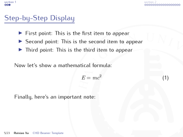 |  | 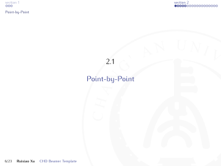 |
| 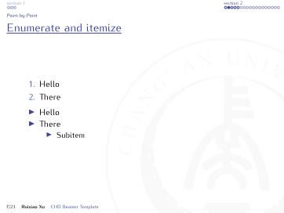 | 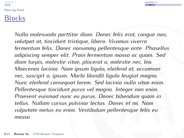 | 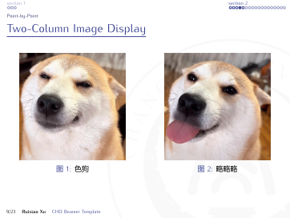 |
| 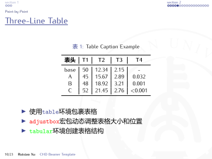 | 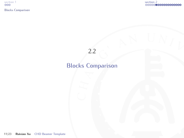 | 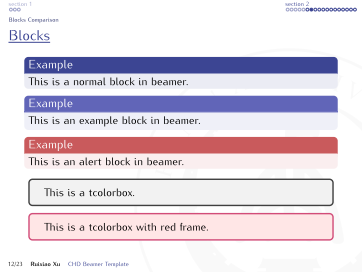 |
| 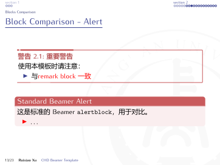 | 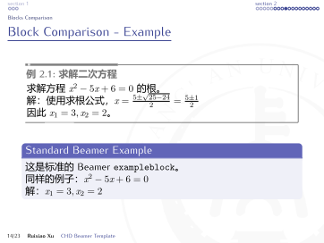 | 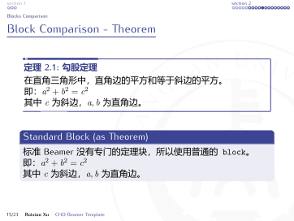 |
| 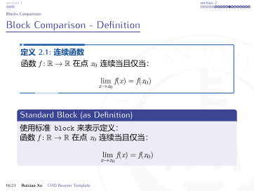 | 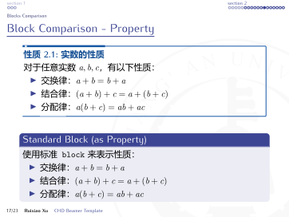 | 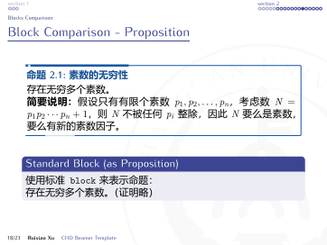 |
| 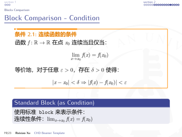 | 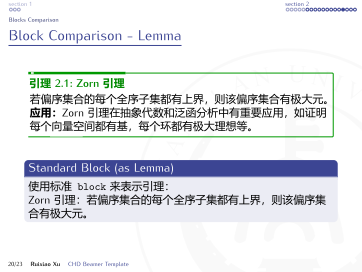 | 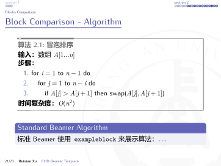 |
| 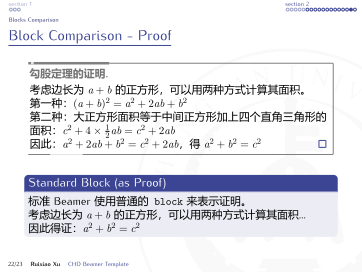 | 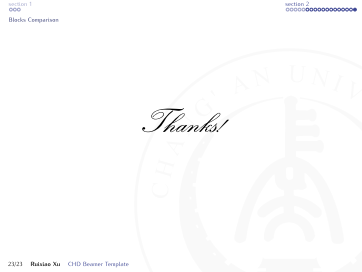 |  |

</div>

