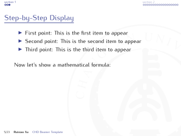
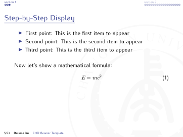

# 🎓 长安大学 Beamer 模板

## 📖 使用说明 

- 请使用 `UTF-8` 编码格式，并设置 `XeLaTeX` 编译 `example.tex`。
- 若需加载参考文献，请设置 `Biber` 进行编译。
- **字体要求**：如果系统中未安装 Kurier 字体，请安装 `fonts/kurier/` 文件夹中的字体文件才能正常编译。
- 使用方法：将 `chdblackground.pdf`、`chdbluelogo.pdf`、`beamerthemechd.sty` 复制到你的目录下，然后在文档中添加：

    ```latex
    \usetheme{chd}
    ```

---
## 🖼️ 示例展示

- 点击图片可放大预览;
- 完整示例请参见 [example.pdf](example.pdf)

<div align="center">
  <a href="images/example_1.png"></a>
  
</div>

<div align="center">
  <a href="images/example_2.png"></a>
  
</div>

<div align="center">
  <a href="images/example_3.png"></a>
  
</div>

<details>
<summary>展开其余预览（共 26 张）</summary>

<div align="center">
  
  <a href="images/example_4.png"></a>
  <a href="images/example_5.png"></a>
  <a href="images/example_6.png"></a>
  <br>
  <a href="images/example_7.png"></a>
  <a href="images/example_8.png"></a>
  <a href="images/example_9.png"></a>
  <br>
  <a href="images/example_10.png"></a>
  <a href="images/example_11.png"></a>
  <a href="images/example_12.png"></a>
  <br>
  <a href="images/example_13.png"></a>
  <a href="images/example_14.png"></a>
  <a href="images/example_15.png"></a>
  <br>
  <a href="images/example_16.png"></a>
  <a href="images/example_17.png"></a>
  <a href="images/example_18.png"></a>
  <br>
  <a href="images/example_19.png"></a>
  <a href="images/example_20.png"></a>
  <a href="images/example_21.png"></a>
  <br>
  <a href="images/example_22.png"></a>
  <a href="images/example_23.png"></a>
  <a href="images/example_24.png"></a>
  <br>
  <a href="images/example_25.png"></a>
  <a href="images/example_26.png"></a>
  <a href="images/example_27.png"></a>
  <br>
  <a href="images/example_28.png"></a>
  <a href="images/example_29.png"></a>
</div>

</details>
